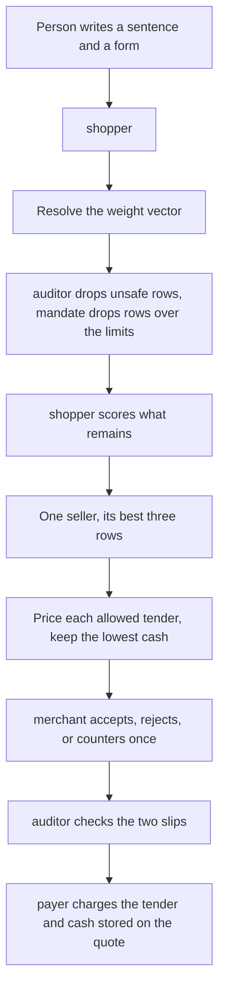

# Scout decisions

Each step is one moment. Read it in order.

- **Situation.** What is true right now.
- **Who.** The role that acts.
- **To.** The role they ask. “No other role” means they decide alone.
- **Task.** What they do.
- **Why.** Why this step exists.
- **Result.** What happens next.

The shopping situations stay in [use-cases.md](use-cases.md). This file is why a role chooses, and why the score uses these numbers. Money is Hong Kong dollars.

Five roles: **shopper** (the buyer), **mandate** (the signed spending form), **merchant** (one website), **auditor** (listings and signatures), **payer** (the only cashier). Only the shopper ranks products. The other four allow, refuse, or charge what the shopper already held.

---

# Who may choose

**Match.** Category, brand, and appearance are gates. A row that fails one of them never receives a score.

**Weight vector.** Five shares of one decision. The form’s payment objective picks the shares. A sentence can ask the person to look at them. It does not replace them after they confirm.

**Lowest cash.** For one row, each allowed tender is priced with only the rule that names that tender. The smallest cash is stored on the quote with that tender’s name. Equal cash keeps the earlier name on the form.

---

## 1. The shopper resolves the weights

The unset form is balanced: relevance 0.35, cash 0.25, rating 0.15, purchases 0.10, history 0.15. The form’s payment objective is the only way to switch the mix. A shopping sentence does not set it.

### Step 1

- **Situation.** The form is valid. The sentence names no mix, or it names the mix already saved on the form.
- **Who.** shopper
- **To.** No other role
- **Task.** Take the vector from the form. If the attempt carries its own five numbers, take those instead.
- **Why.** The signed form is the person’s standing preference. A later vector on this attempt is a deliberate override of that standing preference.
- **Result.** Those five numbers are the ones used for every row in this search.

### Step 2

- **Situation.** The sentence names a packaged mix that is not the one saved on the form. One phrase is enough: cheapest, lowest cash, 最便宜, or 最低现金; most relevant, best match, or 最相关; highest rated, best rated, top rated, or 评分最高; most popular, popularity, 最热门, or 人气; bought before, familiar, or 买过. Two named mixes in one sentence are the same conflict.
- **Who.** shopper
- **To.** the person
- **Task.** Ask them to confirm, and keep the form’s vector on the quote path.
- **Why.** A phrase in one sentence and a signed objective are two instructions. The signed one stays unless the person picks another mix on the form and saves it.
- **Result.** After they confirm, ranking uses the form’s shares. If they decline, the attempt stops.

### Step 3

- **Situation.** One of the five numbers is missing, negative, or not a number.
- **Who.** shopper
- **To.** No other role
- **Task.** Stop.
- **Why.** A broken share would make every later comparison meaningless.
- **Result.** Nothing is searched. The reason is “Weights must be finite and at least 0.”

---

## 2. The shopper chooses a product

Rows already past the auditor and the mandate. Brand, colour, and category have already removed mismatches.

### Step 1

- **Situation.** Two or more clean rows remain. Rewards may be on or off.
- **Who.** shopper
- **To.** No other role
- **Task.** Give each row the six parts in [Why these shares](#why-these-shares), add them, and sort high to low. Break a remaining tie by `sku_id`.
- **Why.** Cash chooses what can be booked. The score chooses which row is offered first. They are different numbers.
- **Result.** The highest score is first.

### Step 2

- **Situation.** The best two scores differ by less than 0.0000000001, including across sellers.
- **Who.** shopper
- **To.** the person
- **Task.** Ask them to choose. Do not negotiate.
- **Why.** A gap that small is rounding dust, not a preference. A real one-cent gap is still larger than this and still ranks. See the cent check below.
- **Result.** The person picks a row, or the attempt stops on timeout or decline.

### Step 3

- **Situation.** One score is strictly first.
- **Who.** shopper
- **To.** merchant
- **Task.** Keep that seller’s best three rows. Ask the website about them in that order.
- **Why.** One order has one seller. The other two rows are substitutes from the same seller if the first row is rejected or countered past the limits.
- **Result.** The winning seller is the only one negotiated. Other sellers are not mixed into the list.

---

## 3. The shopper chooses a card

Merchandise 280, shipping 20. The form lists hsbc-visa, then citi-mastercard, then wallet.

### Step 1

- **Situation.** The row has a rule for one named tender, and the form allows that tender.
- **Who.** shopper
- **To.** No other role
- **Task.** Price hsbc-visa with only the hsbc rule, citi-mastercard with only the citi rule, and wallet with no card rule.
- **Why.** A discount belongs to the tender named on the rule. Two rules do not stack on one charge.
- **Result.** hsbc-visa is 260, citi-mastercard is 290, wallet is 300. The quote stores tender hsbc-visa and cash 260.

### Step 2

- **Situation.** Two tenders land on the same cash.
- **Who.** shopper
- **To.** No other role
- **Task.** Keep the name that appears earlier on the form.
- **Why.** The money is the same, so the person’s own order on the form is the remaining instruction. No extra score is invented to break the tie.
- **Result.** That earlier tender and that cash are what confirm will send to the payer.

---

## 4. The mandate allows or stops

### Step 1

- **Situation.** The shopper asks whether a row or a quote fits.
- **Who.** mandate
- **To.** shopper
- **Task.** Compare the pre-coupon line with 250. Compare cash, after the card discount, with 400, with this goal’s remaining share, and with the week left. Check that the tender is one the form lists.
- **Why.** The website does not know the person’s limits. A confirm cannot raise them.
- **Result.** A row that fails is dropped, with the gate’s reason. A quote that fails is not paid.

---

## 5. The auditor drops a row or a signature

### Step 1

- **Situation.** A listing’s text tells the agent to ignore the mandate, the agent price is higher than the human price, or shipping is missing.
- **Who.** auditor
- **To.** shopper
- **Task.** Drop that row and continue with the clean ones.
- **Why.** One bad listing is data. It does not end the request while another clean row remains.
- **Result.** The trace has one row per drop, with the sku and the rule name.

### Step 2

- **Situation.** The person has confirmed. The shopper asks for the slips.
- **Who.** auditor
- **To.** shopper
- **Task.** Check the signed form and the signed quote against this mandate, this seller, and this cash.
- **Why.** The payer must not run until both slips match what the person saw.
- **Result.** A match continues. One flipped character, a swapped seller, or a cash total that differs stops the attempt. Nothing is booked.

---

## 6. The merchant answers once

### Step 1

- **Situation.** The shopper holds one row from this website.
- **Who.** merchant
- **To.** shopper
- **Task.** Accept the quoted shelf, coupon, and shipping, or reject them, or send one counter that changes shipping or the coupon.
- **Why.** The catalogue is the seller’s answer. The shelf stays the human price. The seller does not see the person’s budget and does not pick a different product.
- **Result.** Accept reserves the coupon. Reject releases it and the shopper tries the next row of the same seller. A counter is checked as text, then as cash. A counter past the limits is skipped.

---

## 7. The payer charges the stored choice

### Step 1

- **Situation.** The slips match. The quote stores a tender name and a cash amount.
- **Who.** shopper
- **To.** payer
- **Task.** Send that tender, that cash, and the vault id created with the account.
- **Why.** The payer books the choice the quote already holds. The vault id is the stored payment reference.
- **Result.** One booking. A generic card uses the raw idempotency key. A named card uses `that-tender:key`. Wallet uses `wallet:key`. The same key and the same cash reconcile to the existing receipt. A different cash on that key stops.

---

# Why these shares

The five default numbers are a stated preference for this mock shop. They were not fitted to purchases. They add to 1 so each share is a fraction of one decision: matching the request 35%, the money 25%, stars 15%, having bought this sku before 15%, and how many people bought it 10%.

A weighted sum is the usual way to add unlike facts. Each fact is turned into a number from 0 to 1, multiplied by its share, and added. Higher is better. A cost such as cash is flipped first, so a lower price becomes a higher part. The flip used here is `1 − this cash / highest cash`, which is the linear cost normalisation when the floor is treated as 0.

| Part | Share | What it measures on a row that is still racing |
| --- | --- | --- |
| Relevance | 0.35 | The full share. Every survivor matched the category, brand, and appearance, so every survivor receives 0.35. |
| Cash | 0.25 | `0.25 × (1 − this cash / highest cash)`. The cash is the cheapest tender the form allows. |
| Rating | 0.15 | `0.15 × stars / 5`. The catalogue stops at 5 stars. |
| Purchases | 0.10 | `0.10 × this count / the highest count still racing`. |
| History | 0.15 | 0.15 if this sku appears on any earlier booking, otherwise 0. |

**Relevance.** The hard filters already removed a row that did not match the sentence. Among the rows that remain, relevance is the same number on every score, so it does not change their order. It is kept at 0.35, the largest share, so the card shows that matching the request was the largest concern in the balanced mode, and so a later partial match can use this same slot. Setting it to 0 would make the card say the request did not count.

**Cash.** Second, because the job is to compare what the person pays, and the balanced mode is not “cheapest only.” A form set to lowest cash moves this share from 0.25 to 0.60 and shrinks the others to 0.20, 0.10, 0.05, 0.05. The same price gap then weighs more than stars or popularity. A sentence that names a different mix asks the person. After they confirm, the form’s shares remain.

**The other packaged mixes.** Each one puts 0.60 on its lead part. Relevance stays 0.20 when it is not the lead, so the card still says the request counted. The other three parts are 0.10, 0.05, and 0.05. They add to 1.

| Mix | Relevance | Cash | Rating | Purchases | History |
| --- | --- | --- | --- | --- | --- |
| Balanced | 0.35 | 0.25 | 0.15 | 0.10 | 0.15 |
| Lowest cash | 0.20 | 0.60 | 0.10 | 0.05 | 0.05 |
| Relevance | 0.60 | 0.20 | 0.10 | 0.05 | 0.05 |
| Rating | 0.20 | 0.10 | 0.60 | 0.05 | 0.05 |
| Popular | 0.20 | 0.10 | 0.05 | 0.60 | 0.05 |
| Familiar | 0.20 | 0.10 | 0.05 | 0.05 | 0.60 |

A relevance mix does not reorder rows that already matched the category, brand, and color. Every survivor still receives the full relevance share. That mix makes matching the largest share on the card and shrinks price, stars, and popularity. Popular, rating, familiar, and lowest cash do change the order. The person picks the mix on the mandate form. A sentence cannot switch it.

**Rating and history.** Equal, and both smaller than cash. Stars are a quality grade on a 0-to-1 scale. History is yes or no: this person has accepted this sku before. That is a familiarity signal. The separate 72-hour question before pay is the safety check for buying the same sku again immediately. Using that same 72-hour window as the score would shrink a familiar item at the moment the person is being asked about it. Any earlier booking keeps the familiarity signal, and the 72-hour rule stays a question.

**Purchases.** Smallest. This is the catalogue’s count, not this person’s own history. Dividing by the highest count in the race puts a shop of 10 sales and a shop of 10,000 sales on the same 0-to-1 scale. At 0.10, popularity can nudge a close call and cannot overturn a large price or star gap.

**A vector that does not add to 1.** An explicit override, such as cash 0.50 with the other four left as they are, is used as written. Rescaling the other four would change numbers the person did not edit.

**Gift.** When rewards are on, score cost is cash minus half the gift. A gift of 100 moves the score cost by 50. Cash stays the amount that can be booked. Half is the published rule for this release: a gift is not money, so it may influence which row is offered and it does not reduce the charge. The reward part is `cash share × (cash − score cost) / highest cash`.

**One cent against the tie line.** Highest cash 1,000, balanced cash share 0.25. One cent changes the score by `0.25 × 0.01 / 1000 = 0.0000025`. The tie line is 0.0000000001. A real cent still ranks. The tie line catches two sums that differ only by floating-point dust.

Worked pair, rewards off, neither sku bought before. Highest cash in the race is 300. Highest purchase count is 10.

| Part | Row A, cash 260, 4 stars, 10 purchases | Row B, cash 300, 5 stars, 2 purchases |
| --- | --- | --- |
| Relevance | 0.35 | 0.35 |
| Cash | 0.25 × (40 / 300) = 0.0333 | 0 |
| Rating | 0.15 × 0.8 = 0.12 | 0.15 |
| Purchases | 0.10 | 0.10 × 0.2 = 0.02 |
| History | 0 | 0 |
| Score | 0.6033 | 0.52 |

Row A wins. The purchase gap of 0.08 and the cash gap of 0.0333 outweigh Row B’s extra star of 0.03. Relevance sits on both scores and does not decide.

The same two rows with the lowest-cash shares:

| Part | Row A | Row B |
| --- | --- | --- |
| Relevance | 0.20 | 0.20 |
| Cash | 0.60 × (40 / 300) = 0.08 | 0 |
| Rating | 0.10 × 0.8 = 0.08 | 0.10 |
| Purchases | 0.05 | 0.01 |
| Score | 0.41 | 0.31 |

Row A still wins. The cash gap is now 0.08, larger than the star gap of 0.02. That is what moving cash from 0.25 to 0.60 does.

---

# Where a reader can see the choice

The offer card shows the five shares, the six parts, the cash, the tender when a discount was used, and the score.

The decision log, on the screen, in the terminal, and in `logs/scout.log` while a run is going, records the same comparison. One line names the shares. One line per scored row names the sku, the cash, the tender, the score, and the six parts. The outcome line names the winning sku. A charge line names the tender, the cash, and the idempotency key. A `card_reprice` row records the next cash and the next tender.

A booking stores the attempt’s trace id. The same idempotency key and the same cash reconcile to that booking.

---

# Sources for the shares

The shares themselves are a prior for two catalogue categories, snacks and groceries. No sales sample was used to estimate 0.35 or 0.25. An allow or deny entry matches a category or a merchant loosely: a plural, a hyphen, or one edit still counts. A word that is not that close, such as toy or balloon, does not.

The shape of the sum is the weighted-sum method: normalise each criterion, multiply by a weight, add. A cost criterion is reversed so that lower cash scores higher. That normalisation, `(highest − this) / highest`, is the linear scale transformation for a cost when the lower end is taken as 0. See Hwang and Yoon, *Multiple Attribute Decision Making* (Springer, 1981), and the weighted-sum account in Triantaphyllou, *Multi-Criteria Decision Making Methods* (Springer, 2000).

Separating a hard filter from a graded score is the usual split between a constraint and a criterion. Category, brand, appearance, and the money limits are constraints. Stars, cash, purchases, and history are criteria. See Belton and Stewart, *Multiple Criteria Decision Analysis* (Springer, 2002).

Weights that add to 1 are a statement of relative importance, a value tradeoff the decision maker declares, not a coefficient fitted from data. See Keeney and Raiffa, *Decisions with Multiple Objectives* (Wiley, 1976). The half-gift rule is this release’s own worked example: shelf 200 × 2, coupon 80, shipping 30, gift 100, so line 400, merchandise 320, cash 350, score cost 300.
