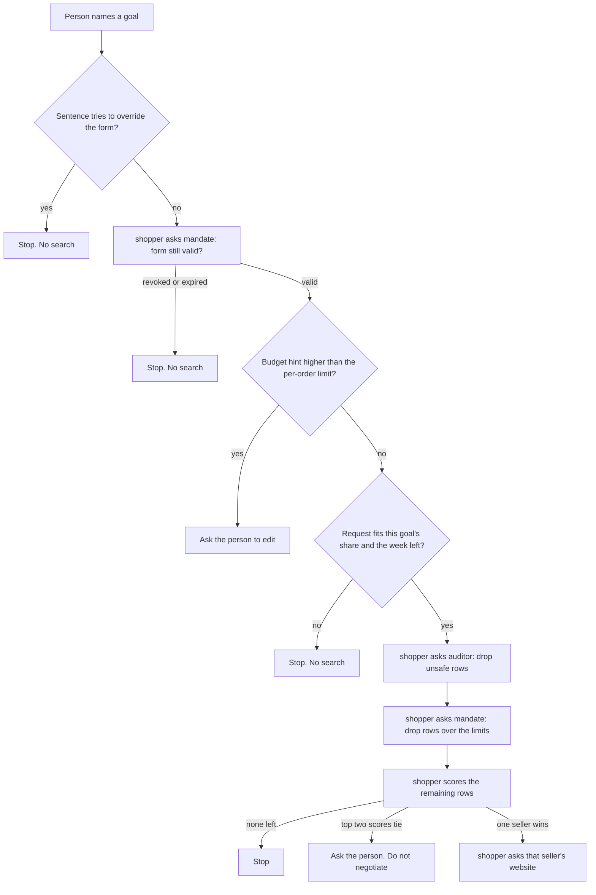
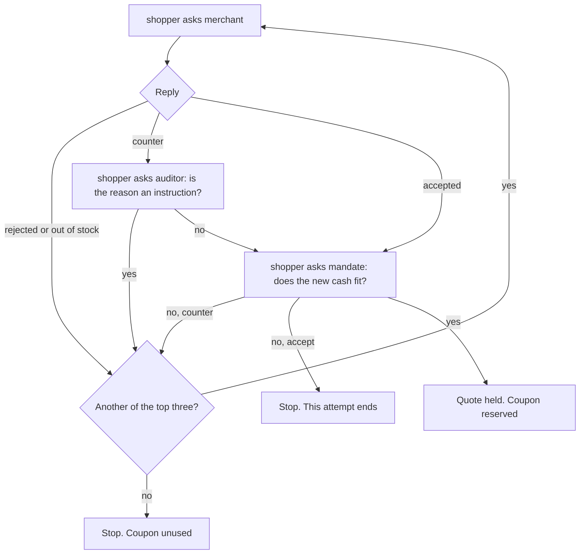
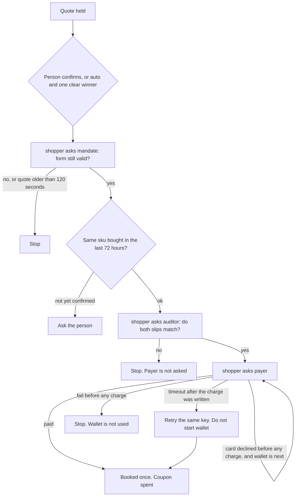
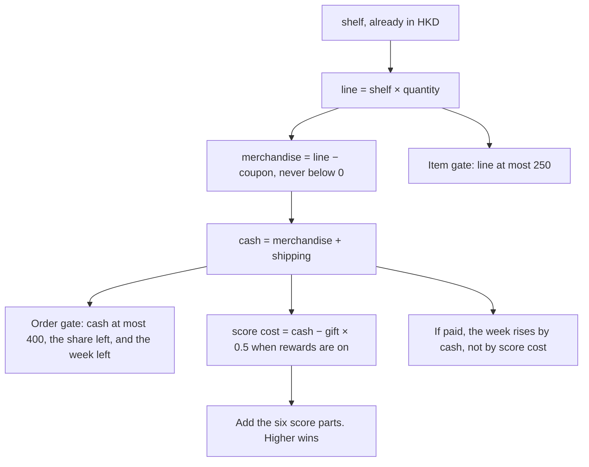
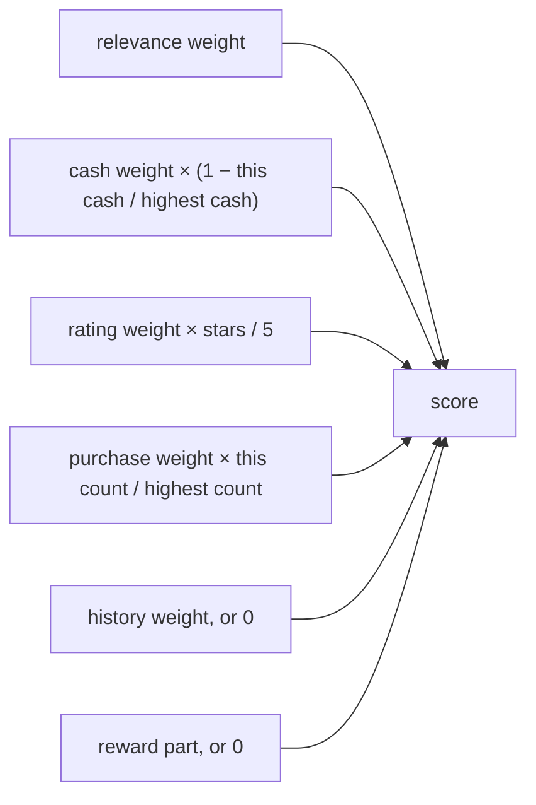

# Scout use cases

Each step is one moment. Read it in order.

- **Situation.** What is true right now.
- **Who.** The role that acts.
- **To.** The role they ask. “No other role” means they decide alone.
- **Task.** What they do.
- **Why.** Why this step exists.
- **Result.** What happens next.

Five roles: **shopper** (the buyer), **mandate** (the signed spending form), **merchant** (one website: Taobao, HKTV Mall, or Pinduoduo), **auditor** (listings and signatures), **payer** (the only cashier).

Money is always in Hong Kong dollars. The default form allows 250 per item before any coupon, 400 per order, and 1,000 in the past 168 hours. Only card and wallet can pay. The person confirms, unless the form says auto and one offer is clearly first.

The numbered flows below are the same gates, one situation at a time. The numbers behind the gates are at the end of this file.

---

# Decision gates

A pass continues down. A fail takes the labeled exit. The shopper asks. The other role answers. The shopper does not skip a failed gate.

## May we shop?



**Unsafe row.** The text says to ignore the mandate, the agent price is higher than the human price, or shipping is missing.

**Limits.** The pre-coupon line is over 250, or cash is over 400, over this goal’s share, or over the week left. Points fails here too.

**Tie.** The best two scores differ by less than 0.0000000001, including across sellers.

## What does the website answer?



**Counter.** The website may change shipping or the coupon once. The shelf stays the shelf. The coupon stays unused until the new cash passes.

**Accept that fails the cash gate.** The whole attempt stops. A failing counter does not. The shopper tries the next row.

## May we pay?



**Slips.** An intent slip is the signed form. A payment slip is the signed quote. One flipped character, a swapped seller, or a cash total that does not match the quote fails the gate.

**Auto.** Same three asks as a person’s confirm. A tie never takes this path.

## How cash and the score are calculated

Cash is what can be booked. The score only chooses a row.



Missing shipping never becomes 0. It drops the row before this picture.

The six parts, added together:



**Score cost.** Used only for ranking. Cash does not shrink when a gift is applied.

**Reward part.** `cash weight × (cash − score cost) / highest cash`, and only when rewards are on. Otherwise 0.

**History part.** The history weight if this sku was bought before. Otherwise 0.

**Highest cash and highest count.** At least 1, so one row does not divide by zero.

Default weights are relevance 0.35, cash 0.25, rating 0.15, purchases 0.10, history 0.15. “Cheapest” uses 0.20, 0.60, 0.10, 0.05, 0.05. A full worked cash example is in [Scores, money, and limits](#scores-money-and-limits).

## Words on the gates

| Word | Meaning |
| --- | --- |
| Coupon reserved | Held for this quote. Not spent until the payer books. |
| Coupon unused | Released. Nothing was booked. |
| Coupon spent | The payer booked this quote. |
| Week | The past 168 hours of booked cash. A refund does not remove it. |
| Share | This goal’s own slice of the request. It cannot borrow from another goal. |
| Seller | `merchant_id`. One order keeps one seller. The website is `platform_id`. |
| Top three | The best three rows of the winning seller only. |
| `credentials_ok` | Both slips match the form and the quote. |
| `credentials_bad` | They do not. The payer is not asked. |

---

## 1. A normal purchase

The person says “red balloons” and later confirms. Cash booked: 60 (shelf 50 + shipping 10).

### Step 1

- **Situation.** The person has named red balloons.
- **Who.** shopper
- **To.** No other role
- **Task.** Turn the sentence into a catalogue goal. Quantity and brand stay editable.
- **Why.** The shop only sells snacks and balloons. A sentence that tries to override the form must not become a search.
- **Result.** One balloon goal is ready.

### Step 2

- **Situation.** A goal exists. The form was signed earlier.
- **Who.** shopper
- **To.** mandate
- **Task.** Ask if the form is still valid.
- **Why.** A revoked or expired form must stop the purchase before any website is called.
- **Result.** The form is valid.

### Step 3

- **Situation.** The sentence may also carry a budget hint.
- **Who.** shopper
- **To.** mandate
- **Task.** Ask if that hint fights the form.
- **Why.** A hint cannot raise the per-order limit or switch the shop.
- **Result.** No fight. Continue.

### Step 4

- **Situation.** This goal has its own share of the request budget.
- **Who.** shopper
- **To.** No other role
- **Task.** Check that each goal spends only its own share.
- **Why.** Unassigned money stays reserved. One goal cannot borrow from another.
- **Result.** The share is allowed.

### Step 5

- **Situation.** The catalogue still contains unsafe rows.
- **Who.** shopper
- **To.** auditor
- **Task.** Ask for the rows that are safe to rank.
- **Why.** A poisoned listing, a higher agent price, or a missing shipping fee must not be offered.
- **Result.** Three rows are dropped: poison, surcharge, and missing shipping. The clean rows stay.

### Step 6

- **Situation.** Clean rows remain.
- **Who.** shopper
- **To.** mandate
- **Task.** Ask which rows fit the cash limits.
- **Why.** A row over the per-item, per-order, share, or 168-hour limit must not be ranked.
- **Result.** The balloon rows fit.

### Step 7

- **Situation.** Several clean rows fit.
- **Who.** shopper
- **To.** No other role
- **Task.** Score them and keep the top three from the winning seller.
- **Why.** One order uses one seller. The score prefers a relevant, cheaper, well-rated row. See the formulas below.
- **Result.** Three offers, one seller. The winner is on Taobao.

### Step 8

- **Situation.** A winning row is chosen.
- **Who.** shopper
- **To.** merchant
- **Task.** Ask that website to accept the row. Only Taobao is called.
- **Why.** The other two websites do not own this row, so they stay silent.
- **Result.** Taobao accepts. Shelf stays 50. Shipping stays 10. The coupon is reserved.

### Step 9

- **Situation.** The website accepted. Cash is 60.
- **Who.** shopper
- **To.** mandate
- **Task.** Ask if 60 fits the form, the goal’s share, and the week.
- **Why.** The website does not know the person’s limits. The form does.
- **Result.** 60 passes. The person is shown the quote. Nothing is booked yet.

### Step 10

- **Situation.** The person confirms that quote.
- **Who.** shopper
- **To.** mandate
- **Task.** Ask again if the form is still valid.
- **Why.** The form may have expired while the person was reading.
- **Result.** The form is still valid.

### Step 11

- **Situation.** The quote is unchanged and the form is valid.
- **Who.** shopper
- **To.** auditor
- **Task.** Ask the auditor to check the intent slip and the payment slip.
- **Why.** The cashier must not run until both signatures match this quote and this form.
- **Result.** Both slips match. Cash is still 60.

### Step 12

- **Situation.** The auditor has passed.
- **Who.** shopper
- **To.** payer
- **Task.** Ask for one card charge of 60, using the stored vault.
- **Why.** The payer is the only role allowed to book cash.
- **Result.** Paid once. Coupon is spent. Cashback is posted. The 168-hour total rises by 60.

---

## 2. Auto pay, one clear winner

Same as the normal purchase through the quote. The form says auto, and one offer is strictly first.

### Step 1

- **Situation.** The quote is ready and no question is open.
- **Who.** shopper
- **To.** mandate, then auditor, then payer
- **Task.** Run the same confirm as a person would: form, signatures, then one charge.
- **Why.** Auto is not a second cashier. It is the same checks without a click.
- **Result.** Paid once. Cash is 60.

---

## 3. Two offers tie

### Step 1

- **Situation.** After ranking, the top two scores are equal, even across sellers.
- **Who.** shopper
- **To.** the person
- **Task.** Stop and ask which offer they want.
- **Why.** The shop must not guess when two rows are equally best.
- **Result.** Nothing is negotiated and nothing is booked.

If nobody answers within 120 seconds, the attempt stops and the coupon stays unused.

---

## 4. The form is already expired

### Step 1

- **Situation.** The person asks for red balloons. The form’s expiry is already past.
- **Who.** shopper
- **To.** mandate
- **Task.** Ask if the form is valid.
- **Why.** Search must not start on a dead form.
- **Result.** Stop. No website is called. Nothing is booked.

A revoked form ends the same way.

---

## 5. The sentence tries to override the form

### Step 1

- **Situation.** The person says to ignore the mandate and buy balloons.
- **Who.** shopper
- **To.** No other role
- **Task.** Read the sentence before any search.
- **Why.** Instructions in the sentence must not change limits, mode, or merchants.
- **Result.** Stop. Nothing is searched. Nothing is booked.

---

## 6. The budget hint fights the form

### Step 1

- **Situation.** The parsed hint is higher than the per-order limit of 400.
- **Who.** shopper
- **To.** mandate
- **Task.** Ask if the hint conflicts with the signed form.
- **Why.** A hint may not raise a limit.
- **Result.** The person is asked to edit the request or the form. Nothing is booked until they do.

---

## 7. Not enough left in the week

### Step 1

- **Situation.** Earlier purchases already used most of the 1,000 allowed in 168 hours. This request needs more than what remains.
- **Who.** shopper
- **To.** No other role
- **Task.** Compare the request budget with the remaining week.
- **Why.** The week is a hard cap. It is not a suggestion.
- **Result.** Stop before search. Nothing is booked.

---

## 8. A refund does not refill the week

### Step 1

- **Situation.** A past receipt was refunded. Its cashback is now 0. Its cash is still inside the 168-hour window.
- **Who.** shopper
- **To.** No other role
- **Task.** Count the week again for a new purchase.
- **Why.** A refund marks the receipt. It does not give the spending room back.
- **Result.** The new purchase still does not fit. Stop. Nothing new is booked.

---

## 9. A poisoned listing

### Step 1

- **Situation.** One row tells the agent to ignore the mandate. A clean sibling from the same seller exists.
- **Who.** shopper
- **To.** auditor
- **Task.** Ask which rows may be ranked.
- **Why.** Instruction text in a description or review is not a product fact.
- **Result.** The poison row is dropped. The clean row continues through accept, signature, and one card payment.

---

## 10. The agent price is higher than the human price

### Step 1

- **Situation.** One row charges an agent more than a person. A clean sibling exists.
- **Who.** shopper
- **To.** auditor
- **Task.** Ask which rows may be ranked.
- **Why.** The agent must not be charged a secret surcharge.
- **Result.** That row is dropped. The clean row is paid once.

---

## 11. Shipping is missing

### Step 1

- **Situation.** The only matching row has no shipping fee.
- **Who.** shopper
- **To.** auditor
- **Task.** Ask which rows may be ranked.
- **Why.** Missing shipping is not zero. Cash cannot be computed without it.
- **Result.** The row is dropped. No clean offer remains. Stop. Nothing is booked.

---

## 12. The website is out of stock

### Step 1

- **Situation.** Every row from the winning seller is out of stock.
- **Who.** shopper
- **To.** merchant
- **Task.** Ask the website that owns each row, one at a time.
- **Why.** Only that website can say the row is gone. The other websites are not called.
- **Result.** Each reply is a rejection. The coupon stays unused. Stop. Nothing is booked.

---

## 13. The website changes shipping, and it still fits

Shelf 200, quantity 1, coupon 0. The website counters with shipping 40.

### Step 1

- **Situation.** The website wants shipping 40 instead of 30. The shelf does not change.
- **Who.** shopper
- **To.** merchant
- **Task.** Receive the one counter.
- **Why.** A website may revise shipping or the coupon once. It may not raise the shelf.
- **Result.** Coupon is unused until the new cash passes the form. New cash is 240.

### Step 2

- **Situation.** The counter reason is ordinary text: “Shipping quote revised.”
- **Who.** shopper
- **To.** auditor
- **Task.** Ask if that text is an instruction.
- **Why.** A counter must not smuggle “ignore the mandate.”
- **Result.** The text is clean.

### Step 3

- **Situation.** Cash would be 240. The per-order limit is 400.
- **Who.** shopper
- **To.** mandate
- **Task.** Ask if 240 fits.
- **Why.** A counter is not accepted until the form agrees.
- **Result.** Quote held. Coupon reserved. The person has not paid yet.

---

## 14. The counter is too expensive, then the next row

First counter: shipping 210, so cash is 410. Limit is 400. A later row has shipping 80, so cash is 280.

### Step 1

- **Situation.** The first counter makes cash 410.
- **Who.** shopper
- **To.** mandate
- **Task.** Ask if 410 fits the per-order limit.
- **Why.** A counter that fails the limit must not book, and must not block a later legal row.
- **Result.** 410 is refused. That coupon stays unused. The shopper asks the next row.

### Step 2

- **Situation.** The next row is a normal accept. Cash is 280.
- **Who.** shopper
- **To.** merchant, then mandate
- **Task.** Accept that row and check 280.
- **Why.** The order can still succeed on a row that fits.
- **Result.** Quote held at 280. Coupon reserved. Not paid until the person confirms.

---

## 15. The counter says “ignore the mandate”

### Step 1

- **Situation.** The counter reason says to ignore the mandate and pay now.
- **Who.** shopper
- **To.** auditor
- **Task.** Ask the auditor to read that reason.
- **Why.** Instruction text is not a shipping update.
- **Result.** The auditor vetoes it. The row is skipped. If no later row fits, stop. Nothing is booked.

---

## 16. The price changes after a yes

The held quote is cash 340 (shelf 200 + shipping 140). The catalogue then changes.

### Step 1

- **Situation.** The person had a quote. A material term changes.
- **Who.** shopper
- **To.** the person
- **Task.** Void the previous confirmation and ask them to accept the new quote or roll back.
- **Why.** A yes applies only to the quote they saw.
- **Result.** The person declines. Coupon returns to unused. Nothing is booked.

The same stop happens if the row disappears, or if they confirm an older version of the quote.

---

## 17. Card is declined before any charge

The form lists card, then wallet.

### Step 1

- **Situation.** Signatures passed. Cash is 60. The card is declined before any charge starts.
- **Who.** shopper
- **To.** payer
- **Task.** Charge 60, walking the tender list.
- **Why.** A decline before charge may try the next allowed tender. A decline after charge may not.
- **Result.** Wallet books once, for the same 60, on a different key. Card is not charged. No second booking.

If the list has no later tender, stop. Nothing is booked.

---

## 18. The charge succeeds, then the reply times out

### Step 1

- **Situation.** The card charge has already been written. The reply then times out.
- **Who.** shopper
- **To.** payer
- **Task.** Retry the same key. Do not start wallet.
- **Why.** The cash is already booked. A new tender would book it twice.
- **Result.** The same key is found and reconciled. Status is paid. Still one booking.

---

## 19. The payer fails before any charge

### Step 1

- **Situation.** Signatures passed. The payer fails before money moves.
- **Who.** shopper
- **To.** payer
- **Task.** Attempt the charge.
- **Why.** A failure before charge is not a successful payment, and it must not skip ahead to wallet.
- **Result.** Stop. Coupon unused. Nothing is booked.

---

## 20. The form lists only points

### Step 1

- **Situation.** The tender list is only points. Card and wallet are the only mock tenders.
- **Who.** shopper
- **To.** mandate
- **Task.** Ask which rows fit, including the tender rule.
- **Why.** Points cannot be charged.
- **Result.** Every row fails that check. Stop. Nothing is booked.

---

## 21. The payment signature is flipped

### Step 1

- **Situation.** The quote is confirmed. One character in the payment slip is wrong.
- **Who.** shopper
- **To.** auditor
- **Task.** Ask the auditor to verify both slips against this quote and this form.
- **Why.** A bad signature must stop the cashier.
- **Result.** The auditor says the signature does not match. The payer is not asked. Nothing is booked.

A swapped merchant or a cash total that does not match the quote ends the same way.

A charge sent before this pass is refused. The payer is not called.

---

## 22. The same item was bought in the last 72 hours

### Step 1

- **Situation.** The quote is for a sku paid in the past 72 hours.
- **Who.** shopper
- **To.** the person
- **Task.** Ask if the repeat is intentional.
- **Why.** A repeat can be a mistake. It is not forbidden.
- **Result.** The person must confirm before pay. If they decline, the coupon returns to unused.

---

## 23. The search or the quote runs out of time

### Step 1

- **Situation.** Search has used its clock (15 seconds, or less if the form says so), or the quote is older than 120 seconds, or a question has sat for 120 seconds.
- **Who.** shopper
- **To.** No other role
- **Task.** Stop the attempt and release the coupon.
- **Why.** A stale quote or an unanswered question must not be paid later.
- **Result.** Stop. Nothing new is booked. A charge that already succeeded is not undone by the clock.

---

## 24. When a model is switched on

`npm run demo` and `npm test` leave this off. They do not call Qwen.

### Step 1

- **Situation.** The switch is on. The person said “red balloons.”
- **Who.** shopper
- **To.** the model
- **Task.** Ask for a draft of goals, quantity, brand, appearance, and a budget hint.
- **Why.** The model may help read the sentence. It may not set price, shipping, tender, or confirm mode.
- **Result.** The draft is read as catalogue fields only. Extra fields are ignored. Bad text stops the search.

### Step 2

- **Situation.** A tool has already decided: accept, cash, a drop, or a signature.
- **Who.** that role
- **To.** the model
- **Task.** Ask for one sentence explaining the tool result.
- **Why.** A person should be able to read why the step happened.
- **Result.** The sentence is stored on the line. Cash, status, coupon, sku, shipping, and the signature stay the tool’s values. If the call fails, the tool result still stands.

### Step 3

- **Situation.** The shopper is about to send the next message after ranking.
- **Who.** shopper
- **To.** the model
- **Task.** Ask which role and which message type should come next.
- **Why.** The model may propose. It may not invent a charge.
- **Result.** If the proposal matches the tool’s next message, that message is sent (`model_turn_ok`). If it differs, or if it names the payer, a charge, or a retry, the proposal is refused (`model_turn_rejected`) and the tool’s message is sent anyway.

One live “red balloons” search did this. It ended at a quote. Cash stayed 60. The first proposal matched negotiate. Two later proposals were refused.

---

# Scores, money, and limits

All amounts below are Hong Kong dollars. Arithmetic is done in cents, then shown as dollars.

## Turning a price into cash

For one row:

```
line         = shelf × quantity
merchandise  = line − coupon, but never below 0
cash         = merchandise + shipping
```

Worked example from the money rule:

| Piece | Amount |
| --- | --- |
| Shelf 200, quantity 2 | line = 400 |
| Coupon 80 | merchandise = 320 |
| Shipping 30 | cash = 350 |

The red-balloon quote in the demo is the same rule at a smaller size: shelf 50 + shipping 10 = cash 60.

Missing shipping is an error. It is not treated as 0.

The per-item limit looks at **line**, before the coupon. The per-order limit, the goal’s share, and the 168-hour limit look at **cash**.

## What a gift does, and what it does not

When rewards are on:

```
score cost = cash − gift × 0.5
```

In the example, gift 100 makes the score cost 300. Cash stays 350. The 168-hour total uses 350, not 300.

When rewards are off, the score cost equals cash.

```
cashback = merchandise × reward rate
```

Shipping is not in the cashback. Cashback is written only after a successful booking. A refund sets that receipt’s cashback to 0.

## Foreign prices

The catalogue may be priced in another currency. It is converted before scoring:

```
HKD = round(amount × rate, to the cent)
```

| Currency | Rate into HKD | Stamp |
| --- | --- | --- |
| HKD | 1 | 2026-10-03 00:00 UTC |
| CNY | 1.08 | same stamp |
| USD | 7.8 | same stamp |

## How offers are scored

Each remaining row gets one score. Higher is better.

Default weights, used unless the sentence asks for cheapest:

| Part | Weight |
| --- | --- |
| Relevance | 0.35 |
| Cash | 0.25 |
| Rating | 0.15 |
| Purchase count | 0.10 |
| Bought this sku before | 0.15 |

If the sentence says cheapest, lowest cash, 最便宜, or 最低现金, the weights become 0.20, 0.60, 0.10, 0.05, 0.05. Weights do not have to add up to 1. A negative or non-numeric weight stops the attempt. If the sentence says cheapest and the form also carries a different explicit weight vector, the person must confirm before ranking continues.

For each row, using the rows still in the race:

```
relevance part = relevance weight
cash part      = cash weight × (1 − this cash / highest cash)
rating part    = rating weight × (stars / 5)
purchase part  = purchase weight × (this row’s purchases / highest purchases)
history part   = history weight, if this sku was bought before; otherwise 0
reward part    = cash weight × (cash − score cost) / highest cash, only when rewards are on
score          = those six parts added
```

Highest cash and highest purchases are at least 1, so a single row does not divide by zero.

The top two scores are a tie when they differ by less than 0.0000000001, including across sellers. A tie asks the person. Otherwise the winning **seller** (not the website) keeps its best three rows. Other sellers are not mixed into that order.

## What the form checks before a quote is payable

A quote passes only when all of these are true:

- The form is valid, not revoked, and not expired.
- The quote is younger than 120 seconds.
- The tender is card or wallet, and the form allows it. An empty tender list means card. Points fails.
- The seller and the category are not denied. An empty allow list means every seller and both categories, except the deny list.
- The pre-coupon line is within 250 per item.
- Cash is within 400 per order, within this goal’s remaining share, and within the remaining 168-hour budget.
- Cash equals merchandise + shipping.

Search may run for at most 15 seconds, or less if the form sets a shorter cap. An open question or a held quote lasts 120 seconds. The same sku bought in the past 72 hours asks the person before pay.

The 168-hour total is the sum of booked cash in that window. Refunded receipts still count.

## What a model is not allowed to change

The model may draft the parse, add one explanation, and propose the next legal message. The tool result wins on cash, shipping, status, the coupon, the sku, the signature, and the booking.
